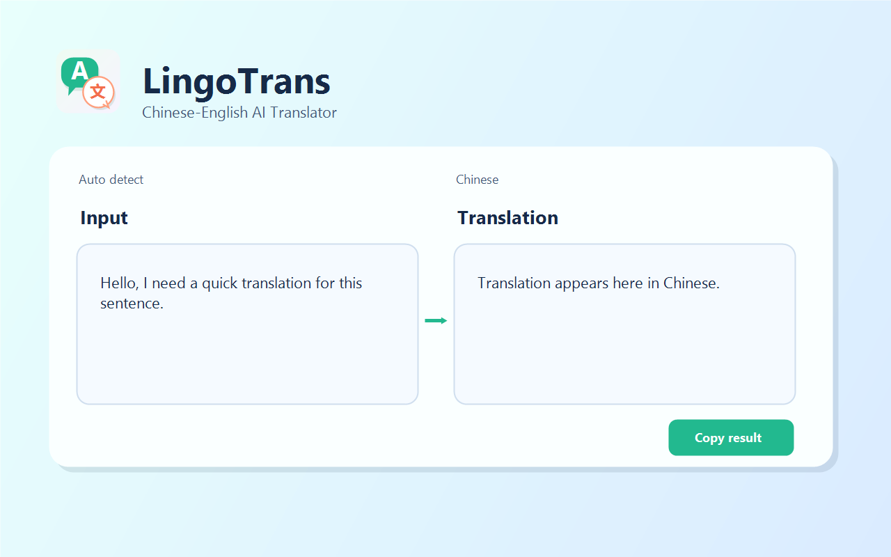
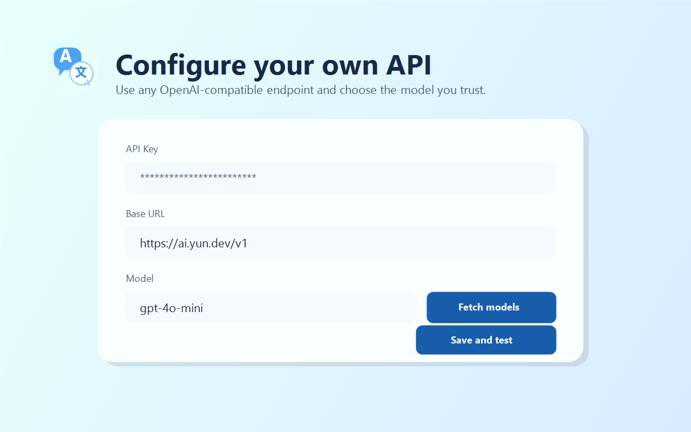
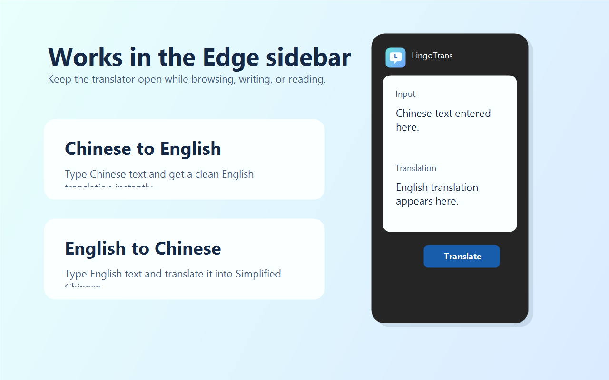
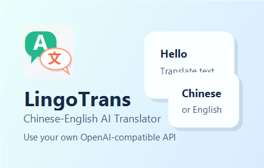
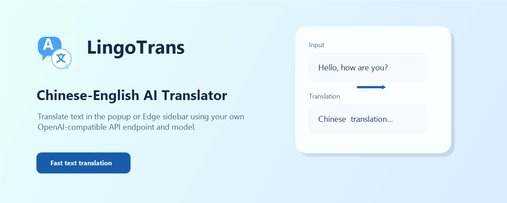

# LingoTrans - AI 中英文本翻译

LingoTrans 是一个面向 Microsoft Edge 的 Manifest V3 扩展。它在扩展弹窗或 Edge 侧栏中提供中英文本互译：输入英文自动翻译为中文，输入中文自动翻译为英文。

## 功能

- 中英文本自动互译
- 支持 Edge 工具栏弹窗和侧栏
- 支持自定义 OpenAI 兼容 `Base URL`
- 支持保存用户自己的 API Key
- 支持获取模型列表并从下拉框选择模型
- 支持复制译文、清空文本、清除账号数据

## 界面预览

### 文本翻译



### 接口设置



### Edge 侧栏



## 商店素材

### Logo


### Small Promotional Tile



### Large Promotional Tile



## 本地安装

1. 打开 Microsoft Edge，进入 `edge://extensions/`。
2. 打开“开发人员模式”。
3. 点击“加载解压缩的扩展”。
4. 选择本项目根目录。
5. 打开 LingoTrans 图标或 Edge 侧栏。

## 配置接口

1. 点击扩展右上角的设置按钮。
2. 填写 `API Key`。
3. 填写 `Base URL`，例如 `https://ai.yun.dev/v1`。
4. 点击“获取模型”。
5. 在“模型”下拉框中选择要使用的模型。
6. 点击“保存并测试”。

测试通过后，回到主界面即可使用。

## 使用翻译器

1. 在左侧输入框输入英文或中文。
2. 插件会自动判断语言方向：
   - 输入英文：翻译为中文
   - 输入中文：翻译为英文
3. 右侧会显示译文。
4. 可以点击“复制译文”复制结果。
5. 可以点击“清空”清除输入和译文。

## 常见问题

### 已保存 Key，但翻译提示“未知请求”

这通常是 Edge 仍在运行旧的扩展后台脚本。

处理方式：

1. 打开 `edge://extensions/`。
2. 找到 LingoTrans。
3. 点击“重新加载”。
4. 关闭并重新打开扩展弹窗或侧栏。

当前版本也带有兜底逻辑：如果后台脚本没有刷新，侧栏会尝试直接使用本机保存的配置请求翻译接口。

### 获取模型成功，但翻译失败

请检查：

- 设置页选择的模型是否支持聊天补全接口。
- `Base URL` 是否以 `/v1` 结尾。
- API Key 是否仍然有效。
- 账号额度或调用权限是否正常。

### 上架前如何清除个人账号数据

进入设置页，点击“清除账号数据”。这个操作会删除浏览器本机保存的 API Key。

不要把个人 API Key 写入源码、截图、提交记录或上架包。当前项目不会内置任何 API Key。

## 项目结构

```text
.
├── assets/                # 扩展图标
├── src/background.js      # 扩展后台：设置、模型列表、翻译请求
├── ui/panel.html          # 弹窗/侧栏主界面
├── ui/panel.css
├── ui/panel.js
├── ui/options.html        # 设置页
├── ui/options.css
├── ui/options.js
├── manifest.json          # Manifest V3 配置
├── PRIVACY.md             # 隐私说明
└── STORE_SUBMISSION.md    # 上架材料参考
```

## 本地检查

```powershell
node --check src\background.js
node --check ui\panel.js
node --check ui\options.js
node -e "const fs=require('fs'); JSON.parse(fs.readFileSync('manifest.json','utf8')); console.log('manifest ok')"
```

## 打包

```powershell
if (Test-Path dist) { Remove-Item -LiteralPath dist -Recurse -Force }
New-Item -ItemType Directory -Path dist | Out-Null
$items = @('manifest.json','src','ui','assets','README.md','PRIVACY.md','STORE_SUBMISSION.md')
Compress-Archive -Path $items -DestinationPath 'dist\lingotrans-edge-extension.zip' -Force
```

## 权限说明

- `storage`：保存用户在浏览器本机填写的接口配置。
- `sidePanel`：在 Edge 侧栏中显示翻译器。
- `<all_urls>`：访问用户配置的 OpenAI 兼容接口。由于 Base URL 由用户配置，上架包需要允许可配置的请求地址。

## 隐私说明

扩展不会运营自己的服务器，也不会收集账号信息。翻译时，用户输入的文本会发送到用户配置的 Base URL；API Key 存储在浏览器本机的扩展存储中。
